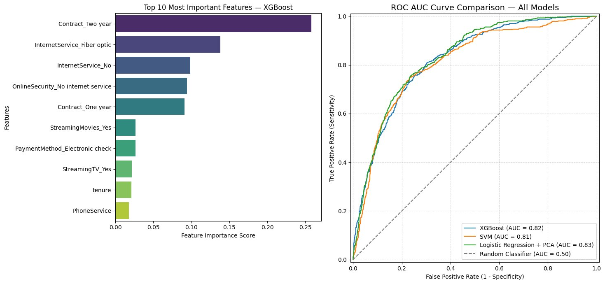

# Customer-churn-prediction-ML
End-to-end customer churn prediction using XGBoost and SHAP. Exploratory data analysis, preprocessing, modeling and business insights.

---

_**Preliminary Results**_



----

| Model                     | ROC AUC | Precision (Churn) | Recall (Churn) | F1 (Churn) |
|---------------------------|---------|-------------------|----------------|------------|
| XGBoost                   | 0.8228  | 0.5357            | 0.7219         | 0.6150     |
| SVM                       | 0.8111  | 0.4910            | 0.7790         | 0.6023     |
| Logistic Regression + PCA | 0.8309  | 0.5029            | 0.7861         | 0.6134     |

------

## EDA


>Python Code


```python
# --- Library imports ---
# pandas and numpy handle all our data manipulation
# matplotlib and seaborn are our visualization tools
# shap lets us explain why the model made each prediction
# sklearn provides the split, encoding, metrics, SVM, and Logistic Regression tools
# xgboost is our primary model
from google.colab import drive
drive.mount('/content/drive')

import pandas as pd
import numpy as np
import matplotlib.pyplot as plt
import seaborn as sns
import shap
from sklearn.model_selection import train_test_split
from sklearn.preprocessing import LabelEncoder, StandardScaler
from sklearn.metrics import classification_report, roc_auc_score, ConfusionMatrixDisplay, RocCurveDisplay
from sklearn.svm import SVC
from sklearn.linear_model import LogisticRegression
from sklearn.decomposition import PCA
from xgboost import XGBClassifier

# Load the dataset
# This is the Telco Customer Churn dataset — publicly available on Kaggle
# It contains 7,043 customers and 21 variables about their service and behavior
df = pd.read_csv('/content/drive/MyDrive/Eproducts/WA_Fn-UseC_-Telco-Customer-Churn.csv')

# .info() shows column names, data types, and how many non-null values exist per column
# This is our first health check — we want to spot any missing data or wrong types immediately
df.info()
df.head(5)
```

>Output


```text
Drive already mounted at /content/drive; to attempt to forcibly remount, call drive.mount("/content/drive", force_remount=True).
<class 'pandas.core.frame.DataFrame'>
RangeIndex: 7043 entries, 0 to 7042
Data columns (total 21 columns):
 #   Column            Non-Null Count  Dtype  
---  ------            --------------  -----  
 0   customerID        7043 non-null   object 
 1   gender            7043 non-null   object 
 2   SeniorCitizen     7043 non-null   int64  
 3   Partner           7043 non-null   object 
 4   Dependents        7043 non-null   object 
 5   tenure            7043 non-null   int64  
 6   PhoneService      7043 non-null   object 
 7   MultipleLines     7043 non-null   object 
 8   InternetService   7043 non-null   object 
 9   OnlineSecurity    7043 non-null   object 
 10  OnlineBackup      7043 non-null   object 
 11  DeviceProtection  7043 non-null   object 
 12  TechSupport       7043 non-null   object 
 13  StreamingTV       7043 non-null   object 
 14  StreamingMovies   7043 non-null   object 
 15  Contract          7043 non-null   object 
 16  PaperlessBilling  7043 non-null   object 
 17  PaymentMethod     7043 non-null   object 
 18  MonthlyCharges    7043 non-null   float64
 19  TotalCharges      7043 non-null   object 
 20  Churn             7043 non-null   object 
dtypes: float64(1), int64(2), object(18)
memory usage: 1.1+ MB
customerID	gender	SeniorCitizen	Partner	Dependents	tenure	PhoneService	MultipleLines	InternetService	OnlineSecurity	...	DeviceProtection	TechSupport	StreamingTV	StreamingMovies	Contract	PaperlessBilling	PaymentMethod	MonthlyCharges	TotalCharges	Churn
0	7590-VHVEG	Female	0	Yes	No	1	No	No phone service	DSL	No	...	No	No	No	No	Month-to-month	Yes	Electronic check	29.85	29.85	No
1	5575-GNVDE	Male	0	No	No	34	Yes	No	DSL	Yes	...	Yes	No	No	No	One year	No	Mailed check	56.95	1889.5	No
2	3668-QPYBK	Male	0	No	No	2	Yes	No	DSL	Yes	...	No	No	No	No	Month-to-month	Yes	Mailed check	53.85	108.15	Yes
3	7795-CFOCW	Male	0	No	No	45	No	No phone service	DSL	Yes	...	Yes	Yes	No	No	One year	No	Bank transfer (automatic)	42.30	1840.75	No
4	9237-HQITU	Female	0	No	No	2	Yes	No	Fiber optic	No	...	No	No	No	No	Month-to-month	Yes	Electronic check	70.70	151.65	Yes
5 rows × 21 columns

.
.
.
```
> Full EDA documentacion and Data processing / training avaliable on payhip!

---


Just made a machine learning and data analysis project from scratch.

The goal was simple: predict which customers are likely to cancel a service before they actually do. A real business problem, solved with real data and real code.

Here's what the process actually looks like 👇
You start with raw data, messy, incomplete, full of decisions to make. Which variables matter? Which ones are noise? What do you do with missing values?
Then comes the modeling part. Picking an algorithm is the easy step. Understanding why it works, how to evaluate it honestly, and how to explain its predictions to someone who doesn't speak Python, that's the real challenge.

A few things I learned along the way:
→ Accuracy alone is a terrible metric. It lies to you when your data is imbalanced.

→ A model that performs well on paper can fail completely in production if you're not careful with how you prepare your data.

→ The most valuable skill isn't writing the code ,  it's being able to explain what the model is actually doing and why it matters for the business.

Machine learning is not magic. It's a lot of careful decisions, one after another.

Full project documentation (Customer Churn Prediction, End to End ML)
https://payhip.com/b/AKxdE
